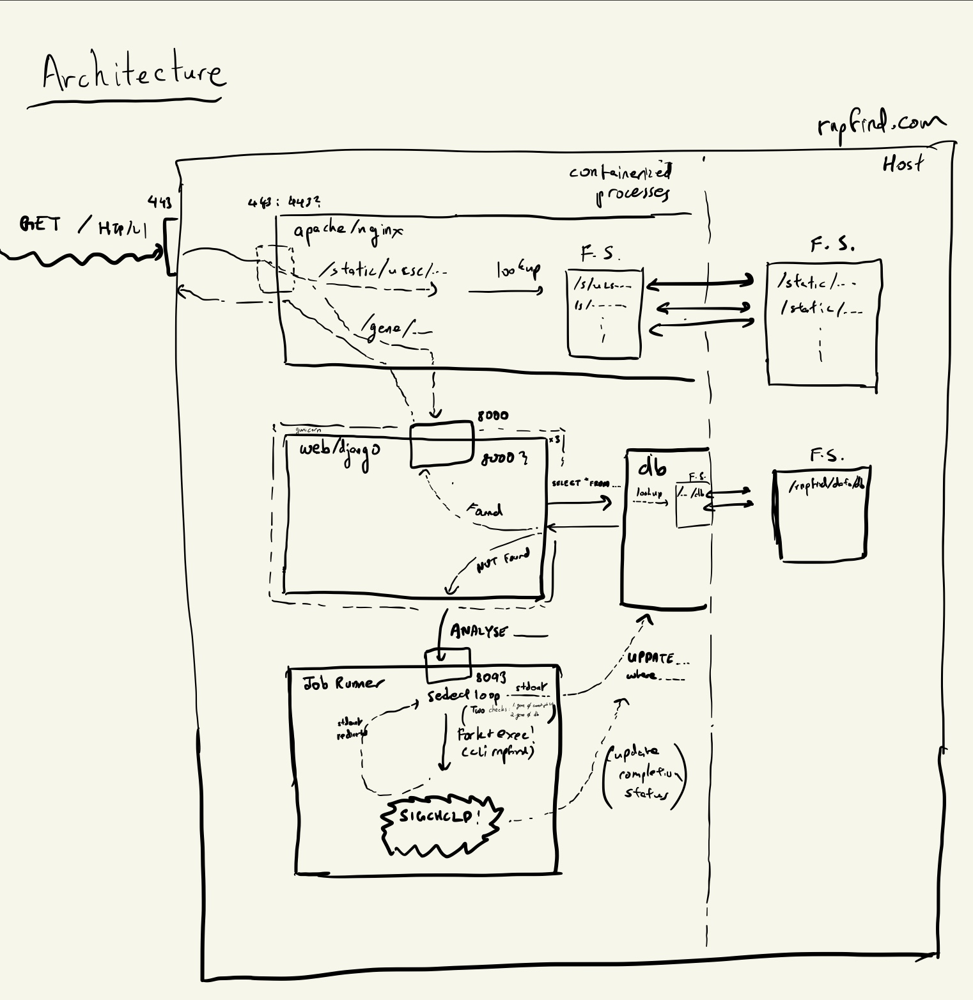

## CLI
 - Fix up CLI tool to take command line options instead of being interactive ✅

## Architecture
 - Come up with a suitable architecture for the web service ✅
 - Think about relation between web service and cli tool ✅

 *Result from above two*:
 

 - Remove dependence on AWS (for ro-data) ✅
 - Create database container or data storage that is permanent to store
   gene analysis results ✅
 - Consider hosting bedfiles directly on running machine for UCSC Genome
   Browser ✅

## Search Engines
 - Look into `robots.txt` and consider creating one

## Requirements
 - Prune suitable requirements for each of the services

## Containerization
 - Reduce image size (base from Alpine, remove apt-caches)
 - Create multiple containers for different processes (computation, web
   serving, database) ✅
 - Orchestrate with compose ✅ (read up on diff between compose and Kubernetes)
 - Mount docker volume for large read-only binding site data (separate data
   from logic)
 - Push to Docker Hub or other suitable registry

## Testing
 - Finish up unit tests
 - Test binding site accuracy

## Methods
 - Implement methods straight from paper methodologies so each data source
   matches database exactly

## Binding Strength
 - Make use of binding strength; add shade on UCSC
 - Make binding density plots a weighted sum based on strengths

## Migrating
 - Migrate from Heroku to personal server, ensure easy docker set up ✅
 - Modify GitLab CI accordingly
 - Figure out daemonization of Django process, fault tolerance, etc.
 - Get d for web

## UI
 - Add chromosome diagrams for anaysis completion view

## Long term analysis
 - Perform background continuous analysis of RNA binding sites
 - Create a single UCSC track for binding site densities for each method,
   host on S3 or server

## Write-up
 - Add explanation on "About" section

## Migrating to GitHub
 - Convert jobs on GitLab to GitHub Actions
 - Disable mirroring on GitLab ✅

## Bugs
 - If gene has no binding sites it could raise errors (at least for POSTAR,
   e.g. SPRR4) ✅ (SPRR4 case onl check for zero binding sites from all
   sources)
 - Unrecognized 'db' errors (no idea how to reproduce)

## Security
 - Direct to HTTPS for UCSC Genome Browser ✅
 - Make personal server use SSL as well ✅

## RBPs
 - Allow generating a track dedicated for a particular RBP showing binding
   sites for all genes analyzed so far

## Genome Browsing
 - Consider using a different genome browser (e.g.
   (JBrowse)[https://github.com/GMOD/jbrowse]) or
   (IGV)[https://github.com/igvteam/igv.js/]

## Stack and setup
 - Consider the scalability of the current set up
 - Consider security against DOS or otherwise
 - Set up production vs development envs
 - Automate production-push
 - Consider serving static files via Apache / nginx instead of Django ✅
